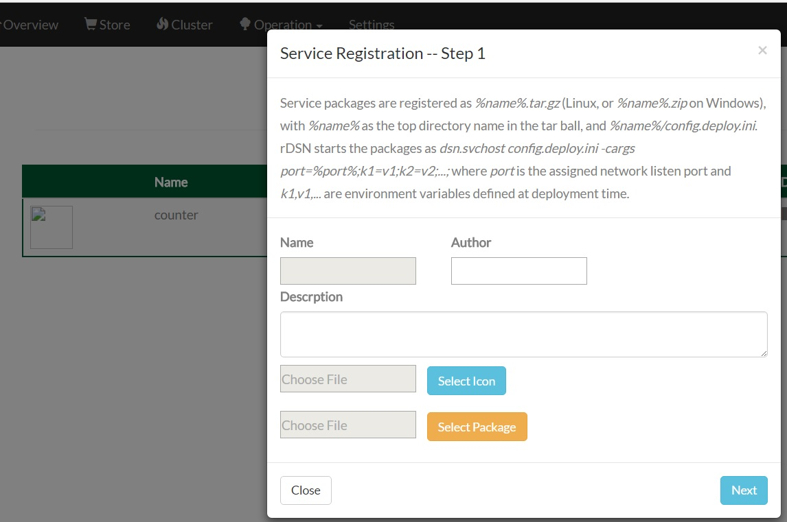
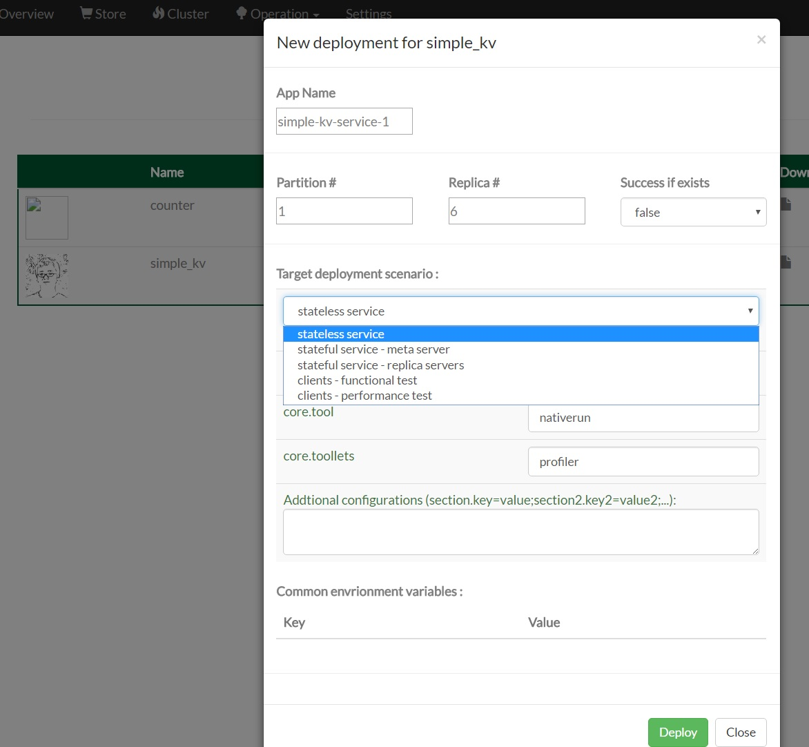
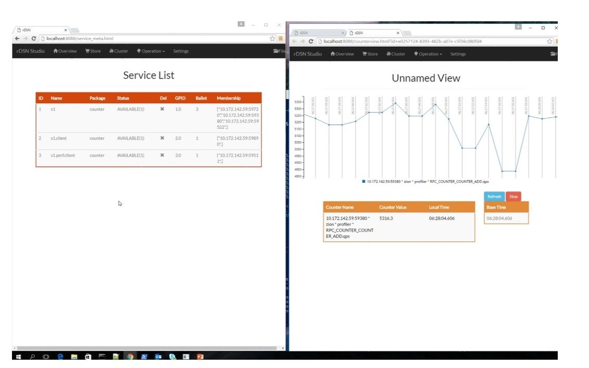
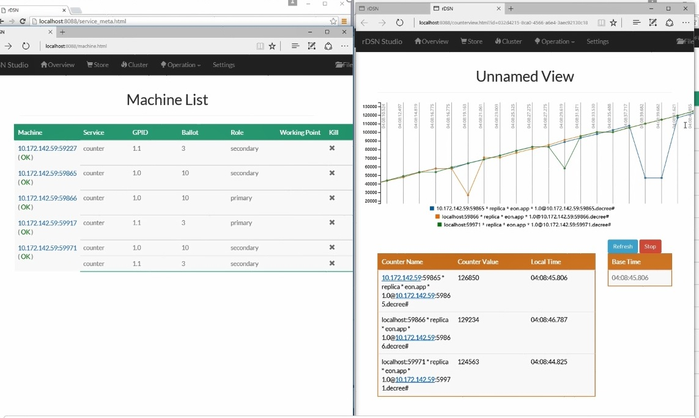

**rDSN.WebStudio** is a web portal for service registration, deployment, testing, and monitoring, as well as cluster management, atop of the service frameworks and tool modules built with rDSN. 

#### Serivce registration and cluster machine view 


#### Service deployment as a stateless service 


#### Service monitoring with built-in profiler toollet 


#### Service deployed as a replicated stateful service 


## Installation

To start rDSN.WebStudio, you should install python 2.7.11+, and run the following commands.

```
python -m pip install --upgrade pip
python -m pip install -r requirement.txt
```

Then you can simply start ```rDSN.WebStudio.py```, and visit ```http://localhost/8080``` to start with.  

## How to use

Check out this [Tutorial](https://github.com/Microsoft/rDSN/wiki/Tutorial:-one-box-cluster).


